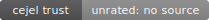

# Cejel OSS trust leaderboard

- Run date: 2026-07-16T03:31:36.221Z
- Cejel version: @cejel/cejel@0.1.3 (75fa69511494)
- Rubric version: witan-rubric-v3-2026-07-13

## How to read this board

- Scores run 0.0-4.0 and come from a deterministic rubric over observable repository signals: tests and CI discipline, secret handling, dependency hygiene, audit trail, and governance.
- Every score on this board is produced by the sealed public scorer used by `npx @cejel/cejel .`. Check out the source commit printed in the report, run the tool, and you will get this number. A required guard does that for every corpus row and compares score, verdict, measured coverage, and evidence. No private domain collector may contribute to any published score, ours included (goal_cejel_board_must_be_reproducible_2026-07-12).
- Verdict bands: Verified (3.5 and above), Conditional (2.5-3.4), At risk (1.5-2.4), Unverified (below 1.5). Conditional is not bad — many healthy, actively developed repositories land there.
- A score reflects observable engineering signals only. It is not a security guarantee, not an audit, and not a judgment of a project's value or its maintainers.
- A score reflects only its MEASURED dimensions. The Coverage column shows how many dimensions were actually measured per category (e.g. "code 4/5 · process 1/6"): a dimension that is not applicable to the repository, or that had insufficient data to measure, produced no score and is excluded from the composite rather than counted against the repository. Unmeasured is not good — it is unknown. Coverage counts every rubric dimension, including the two dimensions the repository scanner marks not applicable for every repository.
- Rows where fewer than half of the dimensions behind a score were measured are marked "low confidence": low coverage — scored on few signals, less certain. A 4.0 measured from one dimension is weaker evidence than a 3.5 measured from five. A score measured on few dimensions is weaker evidence than a score measured on many, so low-confidence rows are published under "Unranked — insufficient coverage" below rather than ranked against better-evidenced rows. This rule is coverage-based only and applies identically to internal and external repositories — it never adjusts, bands, or discounts the score itself.
- A repository written in a language Cejel does not read at all gets no score, no rank, and no verdict band — see "Insufficient source — repositories Cejel cannot read" below. This is a different state from "low confidence": a low-confidence row is still a real score on few dimensions, an insufficient-source row is not a score at all.
- A repository that scores low on a dimension shows its specific findings in the linked evidence report — the findings are the substance, not the verdict.
- Overall, Code trust, and Process trust are each repository's own figures — the exact numbers on its linked certificate, .md report, badge, and JSON. They never change to make ranking fair; nothing here is ever recomputed on a second basis and shown under the same name.
- Ranked score (common dimensions) is a SEPARATE figure used only to order this table. It excludes two repository-inapplicable process dimensions for every report. Under rubric v3 the repository scanner marks both dimensions not applicable for every repository, including ours; the explicit exclusion remains as a fail-closed safeguard for legacy or structured-input reports. This table is sorted by Ranked score, not Overall.
- The whole corpus is published, sorted by score, including this repository itself. A repository that fails to clone or score appears as a loud ERROR row with the reason — it is never silently dropped, and it is retried on the next run.
- The generator is incremental: a repository with an up-to-date committed evidence report is not re-cloned, so the corpus can grow while every run stays synchronous. Re-scoring everything is a --force flag away.
- External repositories are fetched read-only at the immutable commits pinned in corpus.json; none of their code is executed. Re-scoring the same pins is a rubric change. Moving a pin is a separate corpus change.

## Ranking

_Overall is each repository's own canonical figure — identical to its linked certificate, .md report, badge, and JSON. This table is ORDERED by "Ranked score (common dimensions)", a separately named figure that excludes two repository-inapplicable dimensions for every report. The v3 repository scanner marks both dimensions not applicable for every repository, including ours; the exclusion remains fail-closed for legacy or structured reports. Rows below the coverage floor are excluded from this table; see "Unranked — insufficient coverage" below. Repositories Cejel cannot read at all are excluded here too; see "Insufficient source — repositories Cejel cannot read" below — nothing is hidden, only left unordered or unscored._

| Rank | Repository | Category | License | Overall | Ranked score (common dimensions) | Code trust | Process trust | Coverage | Findings | Verdict | Badge | Evidence |
|---|---|---|---|---|---|---|---|---|---|---|---|---|
| 1 | [axios](https://github.com/axios/axios) | library-js | MIT | 3.3 | 3.3 | 2.6 | 3.9 | code 5/5 · process 4/6 | 3 | Conditional |  | [certificate](reports/axios.html) · [report](reports/axios.md) · [json (machine-readable)](reports/axios.json) |
| 2 | [vite](https://github.com/vitejs/vite) | tooling-build | MIT | 3.3 | 3.3 | 2.6 | 4.0 | code 5/5 · process 3/6 | 2 | Conditional |  | [certificate](reports/vite.html) · [report](reports/vite.md) · [json (machine-readable)](reports/vite.json) |
| 3 | [pydantic](https://github.com/pydantic/pydantic) | library-python | MIT | 3.2 | 3.2 | 2.9 | 3.5 | code 3/5 · process 3/6 | 1 | Conditional |  | [certificate](reports/pydantic.html) · [report](reports/pydantic.md) · [json (machine-readable)](reports/pydantic.json) |
| 4 | [react](https://github.com/facebook/react) | framework-web | MIT | 3.2 | 3.2 | 2.5 | 3.9 | code 4/5 · process 3/6 | 3 | Conditional |  | [certificate](reports/react.html) · [report](reports/react.md) · [json (machine-readable)](reports/react.json) |
| 5 | [alfred](reports/alfred.md) | internal-substrate | AGPL-3.0-only | 3.1 | 3.1 | 2.4 | 3.8 | code 5/5 · process 4/6 | 5 | Conditional |  | [certificate](reports/alfred.html) · [report](reports/alfred.md) · [json (machine-readable)](reports/alfred.json) |
| 6 | [svelte](https://github.com/sveltejs/svelte) | framework-web | MIT | 3.1 | 3.1 | 2.9 | 3.3 | code 4/5 · process 3/6 | 3 | Conditional |  | [certificate](reports/svelte.html) · [report](reports/svelte.md) · [json (machine-readable)](reports/svelte.json) |
| 7 | [zod](https://github.com/colinhacks/zod) | library-js | MIT | 3.0 | 3.0 | 2.8 | 3.2 | code 4/5 · process 3/6 | 1 | Conditional |  | [certificate](reports/zod.html) · [report](reports/zod.md) · [json (machine-readable)](reports/zod.json) |
| 8 | [biomejs](https://github.com/biomejs/biome) | tooling-build | MIT OR Apache-2.0 | 2.9 | 2.9 | 2.8 | 3.0 | code 4/5 · process 4/6 | 3 | Conditional |  | [certificate](reports/biomejs.html) · [report](reports/biomejs.md) · [json (machine-readable)](reports/biomejs.json) |
| 9 | [requests](https://github.com/psf/requests) | library-python | Apache-2.0 | 2.9 | 2.9 | 2.4 | 3.4 | code 3/5 · process 4/6 | 1 | Conditional |  | [certificate](reports/requests.html) · [report](reports/requests.md) · [json (machine-readable)](reports/requests.json) |
| 10 | [scorecard](https://github.com/ossf/scorecard) | supply-chain-governance | Apache-2.0 | 3.0 | 2.9 | 2.3 | 3.6 | code 4/5 · process 3/6 | 4 | Conditional |  | [certificate](reports/scorecard.html) · [report](reports/scorecard.md) · [json (machine-readable)](reports/scorecard.json) |
| 11 | [vue](https://github.com/vuejs/core) | framework-web | MIT | 2.9 | 2.9 | 2.4 | 3.4 | code 4/5 · process 3/6 | 2 | Conditional |  | [certificate](reports/vue.html) · [report](reports/vue.md) · [json (machine-readable)](reports/vue.json) |
| 12 | [express](https://github.com/expressjs/express) | framework-node | MIT | 2.8 | 2.8 | 2.6 | 3.0 | code 3/5 · process 3/6 | 3 | Conditional |  | [certificate](reports/express.html) · [report](reports/express.md) · [json (machine-readable)](reports/express.json) |
| 13 | [fastapi](https://github.com/fastapi/fastapi) | framework-python | MIT | 2.9 | 2.8 | 2.5 | 3.2 | code 3/5 · process 3/6 | 2 | Conditional |  | [certificate](reports/fastapi.html) · [report](reports/fastapi.md) · [json (machine-readable)](reports/fastapi.json) |
| 14 | [flask](https://github.com/pallets/flask) | framework-python | BSD-3-Clause | 2.8 | 2.7 | 2.5 | 3.0 | code 4/5 · process 3/6 | 4 | Conditional |  | [certificate](reports/flask.html) · [report](reports/flask.md) · [json (machine-readable)](reports/flask.json) |
| 15 | [fmt](https://github.com/fmtlib/fmt) | library-cpp | MIT | 2.7 | 2.7 | 2.2 | 3.2 | code 3/5 · process 4/6 | 3 | Conditional |  | [certificate](reports/fmt.html) · [report](reports/fmt.md) · [json (machine-readable)](reports/fmt.json) |
| 16 | [esbuild](https://github.com/evanw/esbuild) | tooling-build | MIT | 2.6 | 2.5 | 2.7 | 2.4 | code 3/5 · process 3/6 | 4 | Conditional |  | [certificate](reports/esbuild.html) · [report](reports/esbuild.md) · [json (machine-readable)](reports/esbuild.json) |
| 17 | [ripgrep](https://github.com/BurntSushi/ripgrep) | library-rust | MIT | 2.2 | 2.2 | 2.4 | 2.0 | code 3/5 · process 3/6 | 4 | At risk |  | [certificate](reports/ripgrep.html) · [report](reports/ripgrep.md) · [json (machine-readable)](reports/ripgrep.json) |

## Insufficient source — repositories Cejel cannot read

We publish repositories we cannot score. Cejel reads a fixed, published list of source languages (see "How to read this board"); a repository written in a language outside that list gets no verdict, no rank, and no score here — not a zero, not a low number, nothing dressed up as a judgment. The reason below names the extensions Cejel actually found and how many of the repository's tracked files matched a recognised source extension. A tool that always returns a number is a tool that is sometimes guessing, and we would rather say so than guess.

| Repository | Category | License | Coverage | Verdict | Badge | Evidence | Reason |
|---|---|---|---|---|---|---|---|
| [carddemo](https://github.com/aws-samples/aws-mainframe-modernization-carddemo) | mainframe-cobol | Apache-2.0 | code 0/5 · process 0/6 · **low confidence** | Insufficient source |  | [certificate](reports/carddemo.html) · [report](reports/carddemo.md) · [json (machine-readable)](reports/carddemo.json) | Cejel does not yet read this repository's dominant source language(s) (.cpy, .jcl, .cbl, .bms, .ps, .ctl) — 9 of 252 source-shaped file(s) (3.6%) are in a language Cejel reads — below the 20% dominance threshold a score would need to be meaningful (329 tracked files in total; manifests, lockfiles, docs, media and bundled binaries are excluded from both sides of the ratio). Cejel abstains from a verdict rather than score a repository whose recognised source is incidental rather than dominant; the Criterion Profile and Measured coverage below show exactly which dimensions were and were not measured. To assess a closed/bundled tool, ingest its scanner output via --ingest <sarif\|scorecard>. |

## Unranked — insufficient coverage

_Below the coverage floor: scored on fewer than half of the applicable dimensions, so the score is weaker evidence than a well-covered row. Published in full — same rubric, same numbers — simply not ordered against better-evidenced rows above. See "How to read this board"._

| Repository | Category | License | Overall | Ranked score (common dimensions) | Code trust | Process trust | Coverage | Findings | Verdict | Badge | Evidence | Reason |
|---|---|---|---|---|---|---|---|---|---|---|---|---|
| [cejel](reports/cejel.md) | internal-tool | AGPL-3.0-only | 3.4 | 3.4 | 2.7 | 4.0 | code 4/5 · process 1/6 · **low confidence** | 2 | Conditional |  | [certificate](reports/cejel.html) · [report](reports/cejel.md) · [json (machine-readable)](reports/cejel.json) | scored on 5 of 11 dimensions — too few to rank |
| [django](https://github.com/django/django) | framework-python | BSD-3-Clause | 3.2 | 3.2 | 2.6 | 3.8 | code 3/5 · process 2/6 · **low confidence** | 1 | Conditional |  | [certificate](reports/django.html) · [report](reports/django.md) · [json (machine-readable)](reports/django.json) | scored on 5 of 11 dimensions — too few to rank |
| [cobra](https://github.com/spf13/cobra) | library-go | Apache-2.0 | 2.6 | 2.5 | 2.8 | 2.3 | code 2/5 · process 2/6 · **low confidence** | 2 | Conditional |  | [certificate](reports/cobra.html) · [report](reports/cobra.md) · [json (machine-readable)](reports/cobra.json) | scored on 4 of 11 dimensions — too few to rank |
| [sinatra](https://github.com/sinatra/sinatra) | framework-ruby | MIT | 2.4 | 2.4 | 2.0 | 2.8 | code 2/5 · process 4/6 · **low confidence** | 3 | At risk |  | [certificate](reports/sinatra.html) · [report](reports/sinatra.md) · [json (machine-readable)](reports/sinatra.json) | scored on 6 of 11 dimensions — too few to rank |
| [automapper](https://github.com/AutoMapper/AutoMapper) | library-csharp | MIT | 1.9 | 1.9 | 1.5 | 2.3 | code 3/5 · process 2/6 · **low confidence** | 3 | At risk |  | [certificate](reports/automapper.html) · [report](reports/automapper.md) · [json (machine-readable)](reports/automapper.json) | scored on 5 of 11 dimensions — too few to rank |
| [guava](https://github.com/google/guava) | library-java | Apache-2.0 | 1.9 | 1.8 | 1.5 | 2.2 | code 3/5 · process 2/6 · **low confidence** | 4 | At risk |  | [certificate](reports/guava.html) · [report](reports/guava.md) · [json (machine-readable)](reports/guava.json) | scored on 5 of 11 dimensions — too few to rank |

## By category

### framework-node

- express — 2.8 (Conditional)

### framework-python

- django — 3.2 (Conditional) — low confidence
- fastapi — 2.9 (Conditional)
- flask — 2.8 (Conditional)

### framework-ruby

- sinatra — 2.4 (At risk) — low confidence

### framework-web

- react — 3.2 (Conditional)
- svelte — 3.1 (Conditional)
- vue — 2.9 (Conditional)

### internal-substrate

- alfred — 3.1 (Conditional)

### internal-tool

- cejel — 3.4 (Conditional) — low confidence

### library-cpp

- fmt — 2.7 (Conditional)

### library-csharp

- automapper — 1.9 (At risk) — low confidence

### library-go

- cobra — 2.6 (Conditional) — low confidence

### library-java

- guava — 1.9 (At risk) — low confidence

### library-js

- axios — 3.3 (Conditional)
- zod — 3.0 (Conditional)

### library-python

- pydantic — 3.2 (Conditional)
- requests — 2.9 (Conditional)

### library-rust

- ripgrep — 2.2 (At risk)

### mainframe-cobol

- carddemo — unrated (Insufficient source) — low confidence

### supply-chain-governance

- scorecard — 3.0 (Conditional)

### tooling-build

- vite — 3.3 (Conditional)
- biomejs — 2.9 (Conditional)
- esbuild — 2.6 (Conditional)

---

Regenerated in the source monorepo by the leaderboard runner and re-staged here on each public extraction (cloning is the only network step, scoring is deterministic).
