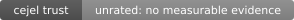

# Cejel OSS trust leaderboard

- Run date: 2026-07-27T01:48:38.955Z
- Cejel version: @cejel/cejel@0.2.1 (ed2aa67323ac)
- Rubric version: witan-rubric-v18-prospective-2026-07-25
- Run environment: prospective v18 D7 correction; equal measured-criterion comparison; verdict bands withheld pending calibration

## How to read this board

- Scores run 0.0-4.0 and come from a deterministic rubric over observable repository signals: tests and CI discipline, secret handling, dependency hygiene, audit trail, and governance.
- Every score on this board is produced through the same sealed public-scoring entry point used by `npx @cejel/cejel@latest .`, with this board's explicit prospective rubric pin shown above. Ordinary public CLI calls that omit a rubric pin remain on calibrated v17. No private domain collector contributes. Public-repository rows pin an immutable public commit and are independently reproducible from it. The explicitly labeled private Alfred transparency snapshot is not independently reproducible because its source commit and evidence locations are not public; it is not presented as a public-repository self-score.
- Verdict bands are withheld on this board. The previous 3.5 "Verified" cutoff was not calibrated against the comparative population, so attaching that label to corrected aggregation would imply evidence we do not have.
- A score reflects observable engineering signals only. It is not a security guarantee, not an audit, and not a judgment of a project's value or its maintainers.
- A score reflects only its MEASURED dimensions. The Coverage column shows how many dimensions were actually measured per category (e.g. "code 4/5 · process 1/6"): a dimension that is not applicable to the repository, or that had insufficient data to measure, produced no score and is excluded from the composite rather than counted against the repository. Unmeasured is not good — it is unknown. Coverage counts every rubric dimension, including the two dimensions the repository scanner marks not applicable for every repository.
- Rows where fewer than half of the dimensions behind a score were measured are marked "low confidence": low coverage — scored on few signals, less certain. A 4.0 measured from one dimension is weaker evidence than a 3.5 measured from five. A score measured on few dimensions is weaker evidence than a score measured on many, so low-confidence third-party rows are published under "Unranked — insufficient coverage" below rather than ranked against better-evidenced rows.
- A repository gets no score, rank, or verdict band when Cejel establishes either structural source absence or zero measurable free-core criteria — see "Unrated — insufficient source or measurable evidence" below. Each row's verdict and reason distinguish those cases. This is different from "low confidence": a low-confidence row is still a real score on few dimensions; an unrated row is not a score at all.
- A repository that scores low on a dimension shows its specific findings in the linked evidence report — the findings are the substance, not the verdict.
- Overall, Code trust, and Process trust are each repository's rubric-native figures — the exact numbers in its linked evidence report. They are retained for auditability, but the board's order uses a separately named comparative figure.
- Comparable score (equal measured criteria) is the board's ordering figure. It excludes two repository-inapplicable process dimensions for every report, then gives every remaining measured criterion equal weight. This applies the pre-statable rule that thin category buckets must not receive disproportionate headline weight; no repository-specific weights or target ranks are used.
- The whole corpus membership is published. Third-party repositories form the calibrated public population. Publisher-owned repositories, including Cejel and the private Alfred snapshot, appear only under "Our own code — shown for transparency, not ranked" and receive no public rank. A repository that fails to clone or score appears loudly in its appropriate population and is never silently dropped.
- The generator is incremental: a repository with an up-to-date committed evidence report is not re-cloned, so the corpus can grow while every run stays synchronous. Re-scoring everything is a --force flag away.
- External repositories are fetched read-only at the immutable commits pinned in corpus.json; none of their code is executed. Re-scoring the same pins is a rubric change. Moving a pin is a separate corpus change.

## Ranking

_This public ranking contains third-party repositories only. It is ordered by "Comparable score (equal measured criteria)": two repository-inapplicable dimensions are excluded uniformly and every remaining measured criterion receives equal weight. Thin buckets therefore cannot take half the headline by construction. Verdict bands are withheld pending calibration. Rows below the coverage floor appear under "Unranked — insufficient coverage"; repositories without a supportable score appear under "Unrated — insufficient source or measurable evidence"._

| Rank | Repository | Category | License | Overall | Comparable score (equal measured criteria) | Code trust | Process trust | Coverage | Findings | Band | Evidence |
|---|---|---|---|---|---|---|---|---|---|---|---|
| 1 | [vite](https://github.com/vitejs/vite) | tooling-build | MIT | 3.4 | 3.3 | 2.8 | 4.0 | code 5/5 · process 3/6 | 3 | Withheld pending calibration | [certificate](reports/vite.html) · [report](reports/vite.md) · [json (machine-readable)](reports/vite.json) |
| 2 | [axios](https://github.com/axios/axios) | library-js | MIT | 3.3 | 3.2 | 2.6 | 3.9 | code 5/5 · process 4/6 | 4 | Withheld pending calibration | [certificate](reports/axios.html) · [report](reports/axios.md) · [json (machine-readable)](reports/axios.json) |
| 3 | [pydantic](https://github.com/pydantic/pydantic) | library-python | MIT | 3.2 | 3.2 | 2.9 | 3.5 | code 3/5 · process 3/6 | 1 | Withheld pending calibration | [certificate](reports/pydantic.html) · [report](reports/pydantic.md) · [json (machine-readable)](reports/pydantic.json) |
| 4 | [svelte](https://github.com/sveltejs/svelte) | framework-web | MIT | 3.1 | 3.1 | 2.9 | 3.3 | code 4/5 · process 3/6 | 2 | Withheld pending calibration | [certificate](reports/svelte.html) · [report](reports/svelte.md) · [json (machine-readable)](reports/svelte.json) |
| 5 | [zod](https://github.com/colinhacks/zod) | library-js | MIT | 3.2 | 3.1 | 3.1 | 3.2 | code 3/5 · process 3/6 | 3 | Withheld pending calibration | [certificate](reports/zod.html) · [report](reports/zod.md) · [json (machine-readable)](reports/zod.json) |
| 6 | [biomejs](https://github.com/biomejs/biome) | tooling-build | MIT OR Apache-2.0 | 3.0 | 3.0 | 2.9 | 3.0 | code 3/5 · process 4/6 | 1 | Withheld pending calibration | [certificate](reports/biomejs.html) · [report](reports/biomejs.md) · [json (machine-readable)](reports/biomejs.json) |
| 7 | [requests](https://github.com/psf/requests) | library-python | Apache-2.0 | 2.9 | 3.0 | 2.4 | 3.4 | code 3/5 · process 4/6 | 1 | Withheld pending calibration | [certificate](reports/requests.html) · [report](reports/requests.md) · [json (machine-readable)](reports/requests.json) |
| 8 | [flask](https://github.com/pallets/flask) | framework-python | BSD-3-Clause | 2.9 | 2.8 | 2.7 | 3.0 | code 4/5 · process 3/6 | 3 | Withheld pending calibration | [certificate](reports/flask.html) · [report](reports/flask.md) · [json (machine-readable)](reports/flask.json) |
| 9 | [react](https://github.com/facebook/react) | framework-web | MIT | 3.0 | 2.8 | 2.1 | 3.9 | code 5/5 · process 3/6 | 4 | Withheld pending calibration | [certificate](reports/react.html) · [report](reports/react.md) · [json (machine-readable)](reports/react.json) |
| 10 | [scorecard](https://github.com/ossf/scorecard) | supply-chain-governance | Apache-2.0 | 2.9 | 2.8 | 2.2 | 3.6 | code 4/5 · process 3/6 | 3 | Withheld pending calibration | [certificate](reports/scorecard.html) · [report](reports/scorecard.md) · [json (machine-readable)](reports/scorecard.json) |
| 11 | [vue](https://github.com/vuejs/core) | framework-web | MIT | 2.9 | 2.8 | 2.4 | 3.4 | code 4/5 · process 3/6 | 3 | Withheld pending calibration | [certificate](reports/vue.html) · [report](reports/vue.md) · [json (machine-readable)](reports/vue.json) |
| 12 | [fmt](https://github.com/fmtlib/fmt) | library-cpp | MIT | 2.6 | 2.7 | 2.0 | 3.2 | code 3/5 · process 4/6 | 3 | Withheld pending calibration | [certificate](reports/fmt.html) · [report](reports/fmt.md) · [json (machine-readable)](reports/fmt.json) |
| 13 | [esbuild](https://github.com/evanw/esbuild) | tooling-build | MIT | 2.5 | 2.5 | 2.6 | 2.4 | code 3/5 · process 3/6 | 4 | Withheld pending calibration | [certificate](reports/esbuild.html) · [report](reports/esbuild.md) · [json (machine-readable)](reports/esbuild.json) |
| 14 | [ripgrep](https://github.com/BurntSushi/ripgrep) | library-rust | MIT | 2.1 | 2.1 | 2.1 | 2.0 | code 3/5 · process 3/6 | 4 | Withheld pending calibration | [certificate](reports/ripgrep.html) · [report](reports/ripgrep.md) · [json (machine-readable)](reports/ripgrep.json) |

## Our own code — shown for transparency, not ranked

_Publisher-owned repositories are disclosed as transparency snapshots outside the calibrated public population. They receive no rank and no verdict band. Alfred is private and cannot be independently reproduced; Cejel is public and independently inspectable._

| Repository | Source visibility | Category | Overall | Comparable score (equal measured criteria) | Code trust | Process trust | Coverage | Findings | Band | Evidence |
|---|---|---|---|---|---|---|---|---|---|---|
| [alfred](reports/alfred.md) | private | internal-substrate | 3.3 | 3.2 | 2.6 | 3.9 | code 5/5 · process 4/6 | 2 | Withheld pending calibration | [certificate](reports/alfred.html) · [report](reports/alfred.md) · [json (machine-readable)](reports/alfred.json) |
| [cejel](https://github.com/BargLabs/cejel) | public | internal-tool | 2.8 | 2.7 | 2.3 | 3.2 | code 5/5 · process 3/6 | 4 | Withheld pending calibration | [certificate](reports/cejel.html) · [report](reports/cejel.md) · [json (machine-readable)](reports/cejel.json) |

## Unrated — insufficient source or measurable evidence

We publish repositories we cannot score. A row here means either that Cejel established structural source absence or that a real source tree produced zero measurable free-core criteria. The Verdict and Reason columns distinguish those cases. Neither state is a zero or a low number dressed up as a judgment: Cejel issues no score and no rank when the evidence does not support one.

| Repository | Category | License | Coverage | Verdict | Badge | Evidence | Reason |
|---|---|---|---|---|---|---|---|
| [carddemo](https://github.com/aws-samples/aws-mainframe-modernization-carddemo) | mainframe-cobol | Apache-2.0 | code 0/5 · process 0/6 · **low confidence** | Insufficient evidence |  | [certificate](reports/carddemo.html) · [report](reports/carddemo.md) · [json (machine-readable)](reports/carddemo.json) | No free-core rubric criterion produced a measurable signal. Cejel abstains rather than publish a numeric zero for an entirely unmeasured repository. Source coverage: 9 of 250 source-shaped files (3.6%) are criterion-ratable, below the 20% reviewable-source threshold (329 tracked files in total). |

## Unranked — insufficient coverage

_Below the coverage floor: scored on fewer than half of the applicable dimensions, so the score is weaker evidence than a well-covered row. Published in full — same rubric, same numbers — simply not ordered against better-evidenced rows above. See "How to read this board"._

| Repository | Category | License | Overall | Comparable score (equal measured criteria) | Code trust | Process trust | Coverage | Findings | Band | Evidence | Reason |
|---|---|---|---|---|---|---|---|---|---|---|---|
| [django](https://github.com/django/django) | framework-python | BSD-3-Clause | 3.2 | 3.1 | 2.6 | 3.8 | code 3/5 · process 2/6 · **low confidence** | 3 | Withheld pending calibration | [certificate](reports/django.html) · [report](reports/django.md) · [json (machine-readable)](reports/django.json) | scored on 5 of 11 dimensions — too few to rank |
| [fastapi](https://github.com/fastapi/fastapi) | framework-python | MIT | 3.1 | 3.1 | 3.0 | 3.2 | code 2/5 · process 3/6 · **low confidence** | 1 | Withheld pending calibration | [certificate](reports/fastapi.html) · [report](reports/fastapi.md) · [json (machine-readable)](reports/fastapi.json) | scored on 5 of 11 dimensions — too few to rank |
| [express](https://github.com/expressjs/express) | framework-node | MIT | 3.0 | 3.0 | 2.8 | 3.2 | code 2/5 · process 3/6 · **low confidence** | 0 | Withheld pending calibration | [certificate](reports/express.html) · [report](reports/express.md) · [json (machine-readable)](reports/express.json) | scored on 5 of 11 dimensions — too few to rank |
| [sinatra](https://github.com/sinatra/sinatra) | framework-ruby | MIT | 2.4 | 2.5 | 2.0 | 2.8 | code 2/5 · process 4/6 · **low confidence** | 3 | Withheld pending calibration | [certificate](reports/sinatra.html) · [report](reports/sinatra.md) · [json (machine-readable)](reports/sinatra.json) | scored on 6 of 11 dimensions — too few to rank |
| [cobra](https://github.com/spf13/cobra) | library-go | Apache-2.0 | 2.5 | 2.4 | 2.6 | 2.3 | code 2/5 · process 2/6 · **low confidence** | 2 | Withheld pending calibration | [certificate](reports/cobra.html) · [report](reports/cobra.md) · [json (machine-readable)](reports/cobra.json) | scored on 4 of 11 dimensions — too few to rank |
| [automapper](https://github.com/AutoMapper/AutoMapper) | library-csharp | MIT | 2.2 | 2.1 | 2.0 | 2.3 | code 3/5 · process 2/6 · **low confidence** | 4 | Withheld pending calibration | [certificate](reports/automapper.html) · [report](reports/automapper.md) · [json (machine-readable)](reports/automapper.json) | scored on 5 of 11 dimensions — too few to rank |
| [guava](https://github.com/google/guava) | library-java | Apache-2.0 | 1.9 | 1.8 | 1.6 | 2.2 | code 3/5 · process 2/6 · **low confidence** | 5 | Withheld pending calibration | [certificate](reports/guava.html) · [report](reports/guava.md) · [json (machine-readable)](reports/guava.json) | scored on 5 of 11 dimensions — too few to rank |

## By category

### framework-node

- express — 3.0 comparable score — low confidence

### framework-python

- django — 3.1 comparable score — low confidence
- fastapi — 3.1 comparable score — low confidence
- flask — 2.8 comparable score

### framework-ruby

- sinatra — 2.5 comparable score — low confidence

### framework-web

- svelte — 3.1 comparable score
- react — 2.8 comparable score
- vue — 2.8 comparable score

### library-cpp

- fmt — 2.7 comparable score

### library-csharp

- automapper — 2.1 comparable score — low confidence

### library-go

- cobra — 2.4 comparable score — low confidence

### library-java

- guava — 1.8 comparable score — low confidence

### library-js

- axios — 3.2 comparable score
- zod — 3.1 comparable score

### library-python

- pydantic — 3.2 comparable score
- requests — 3.0 comparable score

### library-rust

- ripgrep — 2.1 comparable score

### mainframe-cobol

- carddemo — — comparable score — low confidence

### supply-chain-governance

- scorecard — 2.8 comparable score

### tooling-build

- vite — 3.3 comparable score
- biomejs — 3.0 comparable score
- esbuild — 2.5 comparable score

---

Regenerated in the source monorepo by the leaderboard runner and re-staged here on each public extraction (cloning is the only network step, scoring is deterministic).
